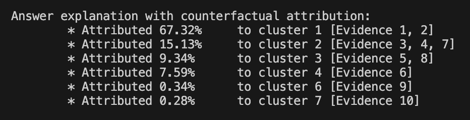

The ConfQuestions benchmark and pipeline code will be released after internal OSS clearance, by 10.03.2025 (before the start of the conference).

Meanwhile, if you have any questions, please send an email to:

rishiraj.saha.roy@iis.fraunhofer.de OR chris.hinze@iis.fraunhofer.de OR joel.schlotthauer@iis.fraunhofer.de

README files for code (`src`) and ConfQuestions (`data`) can be found inside respective directories. Below, we provide a general description of the methodology used in this project.

# Artifacts

- Code: src/
- ConfQuestions: data/
- Poster: [artifacts/2025-02-13-poster-wsdm.pdf](artifacts/2025-02-13-poster-wsdm.pdf)
- Slides: Coming soon!
- Demo video: Coming soon!
- Screenshots: Coming soon!
- Manuscript: https://arxiv.org/abs/2412.10571v3

# Project overview

Retrieval Augmented Generation (RAG) works as a backbone for interacting with an enterprise's own data via Conversational Question Answering (ConvQA). In a RAG system, a retriever fetches passages from a collection in response to a question, which are then included in the prompt of a large language model (LLM) for generating a natural language (NL) answer. However, several RAG systems today suffer from two shortcomings: (i) retrieved passages usually contain their raw text and lack appropriate document context, negatively impacting both retrieval and answering quality; and (ii) attribution strategies that explain answer generation typically rely only on similarity between the answer and the retrieved passages, thereby only generating plausible but not causal explanations. In this work, we demonstrate RAGONITE, a RAG system that remedies the above concerns by: (i) contextualizing evidence with source metadata and surrounding text; and (ii) computing counterfactual attribution, a causal explanation approach where the contribution of an evidence to an answer is determined by the similarity of the original response to the answer obtained by removing that evidence. To evaluate our proposals, we release a new benchmark ConfQuestions: it has 300 hand-created conversational questions, each in English and German, coupled with ground truth URLs, completed questions, and answers from 215 public Confluence pages. These documents are typical of enterprise wiki spaces with heterogeneous elements. Experiments with RAGONITE on ConfQuestions show the viability of our ideas: contextualization improves RAG performance, and counterfactual explanations outperform standard attribution. An example of a canonical conversation for this work is provided below:

~~~
Question 1: What was the BIOS and Build versions used for Dell Optiplex 7040 in the OpenXT 9.0 measurement tests?

Answer 1: Build version: 6662 and BIOS version: 1.14.0

Question 2: And what about TPM?

Answer 2: Version 2.0

Question 3: Which OpenXT 9.0.2 tests did Dell 9010 pass for the legacy system?

Answer 3: OpenXT 8.0.2-pre ($1909), OTA to OpenXT 9.0.2 ($6768), and OpenXT 9.0.2-pre ($6768)

Question 4:	Which machines were tested with both legacy and EFI for OXT 9.0.2?

Answer 4: Dell Latitude 7470 and Dell Optiplex 7050

Question 5: Coming back to OXT 9.0, did the Optiplex 7060 pass the UEFI OTA upgrade 8.0.1 to 9.0.0 test?

Answer 5: No
~~~

**Motivation** "Talk to your data" is a major research theme today, where users interact with local knowledge repositories to satisfy their information needs. Conversational question answering (ConvQA) is a natural choice for such interactions, where a user starts with a self-sufficient (intent-explicit) question, and follows that up with more ad hoc, conversational questions that leave parts of the context unspecified (intent-implicit). Hand in hand, the emergence of powerful large language models (LLMs) has led to retrieval augmented generation (RAG) as the backbone for designing QA systems over one's own data. In RAG pipelines, given a question, a retriever fetches relevant evidence from local data, and this is passed on to an LLM for a concise and fluent answer to the user's question. Enterprise knowledge repositories usually consist of documents with heterogeneous elements, i.e. they often contain interleaved tables, lists and passages (henceforth, we use the unifying term evidence). Typical examples of such documents with mixed structured and unstructured elements are meeting notes, test reports, or product descriptions. The setting for this demo is ConvQA with RAG over such heterogeneous document collections.

**Limitations of state-of-the-art** Over the last four years, RAG has been a topic of intense investigation. Beyond literature, organizations like LangChain, LlamaIndex, or Cohere offer frameworks to build RAG systems. We posit that despite several advanced features, these suffer from two basic concerns, one at each end of the pipeline: (i) at the beginning, documents are typically split into chunks (usually one or more passages) that are indexed on their content. When these chunks are retrieved and fed to an LLM, they often lack supporting context from the document, which adversely affects both retrieval, and subsequent answering; and (ii) at the end, attribution mechanisms that attach provenance likelihoods of the answer to the retrieved units of evidence, are solely based on statistical similarity between the answer and the evidence: these are not causal, but rather only plausible explanations. Moreover, current pipelines support raw text and rarely mention how tabular elements could be handled.

**Contributions** We make the following salient contributions through this work:
- We demonstrate RAGONITE, a new RAG system that concatenates page titles, headings, and surrounding text to raw contents of evidences for better retrieval and answering;
- We compute counterfactual attribution distributions over retrieved evidences as causal explanations for answers;
- We bring tables under RAGonite’s scope by linearizing each record (row) via verbalization and similar techniques;
- We create ConfQuestions, a benchmark with 300 conversational questions for evaluating RAG-based heterogeneous QA. The benchmark and all other artifacts for this work are public at https://github.com/Fraunhofer-IIS/RAGonite.

## System outline

**Backend** An overview of the RAGONITE pipeline is in Figure 1. RAGONITE's backend is split into a functional core, which handles retrieval and answer generation, and a stateful layer that persists chats into a SQLite database and provides a REST API to the frontend using FastAPI. The dependencies in the functional core include the vector database (ChromaDB), and prompt template (Jinja) and LLM libraries (gpt-4o and Llama-3.1-8B). We use ChromaDB as our vector database for storing the contextualized evidences, and also use ChromaDB's in-built retrieval functions. The multilingual [BGE embedding model](https://huggingface.co/BAAI/bge-m3) was used to embed evidences, that was found to work slightly better than [text-embedding-3-small](https://openai.com/index/new-embedding-models-and-api-updates/) from OpenAI. While ChromaDB was used for its extensibility, we also explored variants like Weaviate and Milvus. We used top-k hybrid search with the [BGE reranker](https://huggingface.co/BAAI/bge-reranker-v2-m3) and reciprocal rank fusion (RRF) being used to merge k dense retrieval and lexical retrieval results. We use GPT-4o as our LLM of choice inside the question completion and answer generation modules for efficiency and quality, but we also support a Llama model in our demo. All prompts can be seen inside the demo interface for transparency. A single GPU server (4x48GB NVIDIA Ada 6000 RTX, 512 GB RAM, 64 virtual cores) was used for all our experiments. All code is in Python.

*Figure 1: The RAGonite workflow enhances RAG pipelines at both ends, preprocessing evidence and explaining answers.*

**Frontend** For the frontend we developed a single-page React application (actually Preact, as a more lightweight React-compatible alternative), intentionally avoiding additional dependencies to eliminate the need for a build process. All API calls in the RAGONITE demonstration are handled by the frontend.

## Demo walkthrough

*Figure 2: An annotated walkthrough the of RAGONITE demo. Blue boxes guide the reader and are not part of the UI.*

We use a screenshot of the RAGONITE main page in Figure 2, on which we overlay numbered blue boxes, for a demo walkthrough. First, a user must select a domain (0) on which to use RAGONITE (our focus here is on enterprise wikis exemplified by Confluence, but RAGONITE also runs on other domains like soccer, automobiles, movies, and fictional universes). Then the user uses the question input box (1) to begin a conversation. Suppose we are at turn two (2): when RAGONITE receives a conversational question as input (like `And what about TPM?` in Turn 2 after `What was the BIOS and Build versions used for Dell Optiplex 7040 in the OpenXT 9.0 measuerment tests?` in Turn 1), it uses its question completion module to rephrase the question into an intent-explicit form using an LLM (3). While the question in the first conversation turn is usually self-contained, follow-up questions are completed using relevant information from previous questions and generated answers. Offline, the heterogeneous document collection is preprocessed via our evidence contextualization module into a pool of evidence where necessary document context is concatenated to the raw contents of the evidence. A retriever then takes the intent-explicit question and searches over the evidence pool, to return top-k question-relevant evidences (4, 4a-c) using the hybrid retrieval score (5). These top-k evidences are inserted into the prompt of another LLM instance to generate the answer (6). Finally, the generated answer and the top-k evidences are fed into our counterfactual attribution module. When a user clicks on "Explain" (6a), a command line window pops up to output the attribution distribution as an explanation of how the answer was potentially constructed. We log user feedback on the answer for future use (7). A user can see a trace through the pipeline using behind-the-scenes buttons (8): for example, retrieval results for lexical and dense search, LLM prompts, and more. Users can adjust retriever and generator configurations (9), see their past conversations (10), including deleted ones (11). Follow-up question suggestions are also provided (12) to help domain exploration. Notably, most open-source RAG demos only consist of the evidence retriever and answer generator modules. On average, RAGONITE requires about one second to answer a question, and approximately two seconds for explaining the answer.

## Evidence contextualization

*Figure 3: Toy wiki page with heterogeneous elements to motivate evidence contextualization. A question like `todo for alice in oct rag meeting?` can only be faithfully answered by joining information in the relevant table row, table footer, page title, and preceding heading and text. This implies that unless the evidence as stored in the DB contains the supporting context, there is no chance that a retriever can fetch it from the corpus with the question as a search query.*

**Idea** Evidence contextualization in current RAG systems mainly involve steps like: (i) coreference resolution for resolving simple pronouns like (s)he, her, his, etc., and (ii) overlapping text chunking involving sliding windows over passages. These have some basic limitations like: (i) resolving pronouns is mainly limited to previous entity references, and is not enough for more subtle coreferences like "these configurations" or "the previous model"; (ii) sliding word/token windows do not generalize well to structured evidence like tables. We, however, adopt a simple but effective alternative of concatenating document context to each evidence at indexing time.

A toy example of an enterprise wiki page is in Figure 4. We begin by capturing text inside `<table> ... </table>` tags as tables. Text inside `<ol>...</ol>` (ordered list) and `<ul>...</ul>` (unordered list) tags are stored as lists. Each span of the remaining text between any `<heading>`-s, or between a `<heading>` and the beginning or end of the document, is assigned to one passage. Each list and each paragraph become individual pieces of evidence.

**Preprocessing** We store each table in a verbalized form, which converts structured evidence to a form more amenable to an LLM prompt while retaining scrutability by a human. In this mode, we traverse left to right in a table row, and linearize the content as :"<Column header 1> is <value 1>, and <Column header 2> is <value 2>, ...". We prepend this text with "Row <id> in Table <id>" to preserve original row ordering information as well as table ordering relative to the page where the content is located. For instance, the second row in the table in Figure 4 would be verbalized as "Row 2 in Table 1: Member is Alice, and Task is Similarity function, and ...". Along with the complete table, each linearized row is also stored as an individual evidence. This helps pinpoint answer provenance to individual rows in tables when possible, as well as resolve comparative questions that are easier when the whole table is in one piece in the prompt.

**Contextualization** At this point, we have passages, lists, tables, and table records as individual evidences. We then concatenate the following items to each piece of evidence: page title, previous heading, the evidence before, and the evidence after. Both the raw textual forms and their embeddings are indexed in our database, enabling lexical and dense search, respectively. Note that indexing whole pages and inserting full text of top-k documents into an LLM prompt cannot easily bypass evidence contextualization, due to arbitrary lengths of web documents: operating at evidence-level is therefore a practical choice.

*Figure 4: Contextualized evidence as in answer prompt.*

An example of contextualized evidence is in Figure 4 (inside dashed box): the raw content of the evidence (the seventh row in the first table) starts with "Row 7 in Table 1 ..." But the previous content starting at "OpenXT 9.0 ..." consists of the page title, preceding heading, and preceding text. "OTA upgrade" at the end comes from adding succeeding text (the table footer here).

## Counterfactual attribution

**Idea** Counterfactual explanations through passage perturbation has been explored in the context of RAG and more generally for LLM understanding, but not for answer attribution and not via evidence removal, as explored in this work. The intuition here is that a definitive way of saying how much an evidence contributed to an answer is to remove the evidence from the prompt, and see how much the original answer 𝑎changed. If it did not change much, then the evidence is unlikely to have played any major role, and vice versa.

*Figure 5: A formal representation of the counterfactual attribution algorithm.*

**Counterfactual Attribution (CFA)** This simple idea is the core of our proposed algorithm (formal representation in Figure 5). The only other confounding factor is the presence of redundant evidences in the prompt: the retriever may sometimes fetch two (or more) semantically equivalent evidences if they both satisfy the user's intent. In the context of counterfactuals, it may be that when one of these redundant evidences are removed, the answer hardly changes. This may lead to the wrong conclusion that the first evidence was unimportant: it just happens that the second evidence makes up for it content-wise. Hence, it is important that we first cluster evidences by content before we apply an iterative removal of each evidence cluster. Each cluster's removal and corresponding counterfactual answer generation is implemented in parallel inside the demo for efficiency, as evidences (clusters) can be processed independent of each other. Moreover, to adjust for non-determinism in LLM generations, we use a Monte Carlo method: in this case it simply means that we repeat the answer generation a few times, compute similarities between the answer and the counterfactual answer in each iteration, and average these values for each cluster. One minus this average similarity is the contribution of each evidence cluster to the original answer: the more similar the answers are, the less an evidence contributed.

These raw answer contribution scores for each evidence cluster are then normalized via masked softmax to derive the final attribution distribution (example in Figure 6). We used the popular DBSCAN algorithm for clustering evidences as it requires only two tunable parameters, and does not require the specification of the number of clusters upfront (hard to predict in our case). Cosine similarity between the text embeddings of the answer and the counterfactual answer (in both cases the completed question from the benchmark is prepended for providing the context in which the similarity is sought) was used as our similarity function. Using [JinaAI embeddings](https://huggingface.co/jinaai/jina-embeddings-v3) to encode evidences which was found to work better than other embedding models (BGE, OpenAI) in this context. While our algorithm produces fairly accurate results, output distributions may sometimes appear to be somewhat degenerate to end users. For example, say among six clusters, the top-evidence cluster is attributed 20% and the remaining five groups are all assigned about 16%. We thus introduce a temperature parameter to introduce a higher visible skew of the distribution towards the top-scoring evidence cluster. Answers and counterfactual answers were generated using the cheaper GPT-4o-mini model (instead of GPT-4o) due to budget constraints: every question entails the generation of up to ten counterfactual answers, which entails a substantially higher number of output tokens than generating the intent-explicit questions or the original answers (where we use GPT-4o).

*Figure 6: Answer explanation by counterfactual attribution.*
